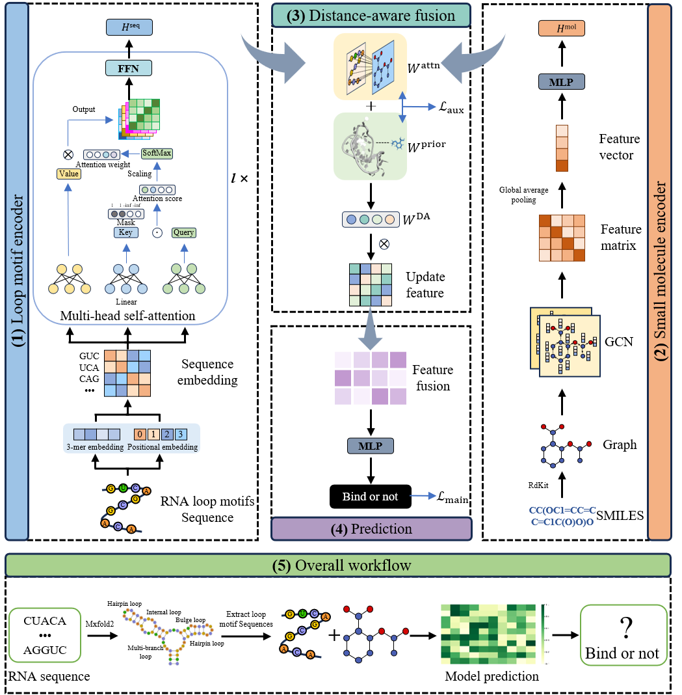

# DistRMI

This is a Pytorch implementation of the paper:"DistRMI: deep distance-aware neural network for explainable RNA loop motif-small molecule interaction prediction"

![framework]


# Requirements

* Python >= 3.11
* PyTorch >= 1.0
* RDkit >= 2024.09
* scikit-learn >=1.5

# Usage

* Training the model by running

  ```
  python training_validation.py
  ```

* Predictions from the models can be generated by running

  ```
  python predict.py
  ```

  
